# TalentBridge — Enterprise Architecture Document

> **Version:** 1.0.0  
> **Status:** Approved for Implementation  
> **Last Updated:** 2026-06-22  
> **Purpose:** Single source of truth for all TalentBridge implementation prompts.

---

## Table of Contents

1. [Executive Summary](#1-executive-summary)
2. [System Architecture](#2-system-architecture)
3. [High Level Architecture Diagram](#3-high-level-architecture-diagram)
4. [Complete Database Design](#4-complete-database-design)
5. [ERD](#5-erd)
6. [All Database Tables](#6-all-database-tables)
7. [Table Relationships](#7-table-relationships)
8. [Folder Structure](#8-folder-structure)
9. [Backend Module Structure](#9-backend-module-structure)
10. [Frontend Module Structure](#10-frontend-module-structure)
11. [API Structure](#11-api-structure)
12. [Authentication Flow](#12-authentication-flow)
13. [Authorization Strategy](#13-authorization-strategy)
14. [Permissions Matrix](#14-permissions-matrix)
15. [User Journeys](#15-user-journeys)
16. [Admin Workflow](#16-admin-workflow)
17. [Employer Workflow](#17-employer-workflow)
18. [Job Seeker Workflow](#18-job-seeker-workflow)
19. [Notification Architecture](#19-notification-architecture)
20. [Resume Builder Architecture](#20-resume-builder-architecture)
21. [Job Recommendation Architecture](#21-job-recommendation-architecture)
22. [Dark Mode Architecture](#22-dark-mode-architecture)
23. [Future Subscription Architecture](#23-future-subscription-architecture)
24. [Development Roadmap](#24-development-roadmap)
25. [Phase-wise Implementation Plan](#25-phase-wise-implementation-plan)
26. [Risks & Scalability Considerations](#26-risks--scalability-considerations)

---

## 1. Executive Summary

**TalentBridge** is an enterprise-grade Applicant Tracking System (ATS) combined with a public Job Portal. It connects three primary personas—**Admin**, **Employer**, and **Job Seeker**—through a unified platform that manages the full recruitment lifecycle: company onboarding, job publishing, candidate discovery, application tracking, interview scheduling, and hiring analytics.

### Vision

Provide a scalable, secure, and modular recruitment platform that serves as the operational backbone for hiring teams while offering job seekers a modern, accessible career portal.

### Technology Foundation

| Layer | Technology |
|-------|------------|
| Backend | Laravel 12, PHP 8.3+ |
| Database | PostgreSQL 16+ |
| Frontend | React 19, TypeScript, Vite |
| UI | Tailwind CSS, ShadCN UI |
| Auth | Laravel Sanctum (SPA + API tokens) |
| Queue / Cache | Redis |
| File Storage | S3-compatible (local in dev) |
| Search | PostgreSQL Full-Text Search (Phase 1); Elasticsearch-ready (Phase 3+) |

### Architectural Principles

- **API-first:** All business logic exposed via versioned REST API; React SPA is a consumer.
- **Feature-based modularity:** Backend and frontend organized by domain feature, not technical layer alone.
- **Clean Architecture:** Controllers → Services → Repositories → Models; dependencies point inward.
- **Security by default:** RBAC, policies, rate limiting, audit trails, secure file handling.
- **Future-ready:** Subscription, AI, i18n, and mobile clients designed as extension points—not afterthoughts.

### Scope of This Document

This document defines architecture, database schema, API contracts, workflows, and implementation phases. **No application code, migrations, or UI components are included.** All future implementation must reference this document.

---

## 2. System Architecture

### 2.1 Layered Architecture

```
┌─────────────────────────────────────────────────────────────┐
│                    Presentation Layer                        │
│         React 19 SPA (TypeScript + ShadCN + Tailwind)        │
├─────────────────────────────────────────────────────────────┤
│                    API Gateway Layer                         │
│    Laravel Routes → Middleware → Controllers (thin)          │
├─────────────────────────────────────────────────────────────┤
│                    Application Layer                         │
│    Services (business logic) + DTOs + Events/Listeners       │
├─────────────────────────────────────────────────────────────┤
│                    Domain Layer                              │
│    Models, Enums, Value Objects, Policies, Rules             │
├─────────────────────────────────────────────────────────────┤
│                    Infrastructure Layer                      │
│    Repositories, File Storage, Mail, Queue, Cache, Search    │
├─────────────────────────────────────────────────────────────┤
│                    Data Layer                                │
│    PostgreSQL + Redis + S3                                   │
└─────────────────────────────────────────────────────────────┘
```

### 2.2 Deployment Topology

| Environment | Components |
|-------------|------------|
| **Production** | Load Balancer → Nginx → PHP-FPM (Laravel) → PostgreSQL (primary + replica) → Redis → S3 |
| **Staging** | Mirrors production at reduced scale |
| **Development** | Laravel Sail / Docker Compose: app, postgres, redis, mailpit |

### 2.3 Communication Patterns

| Pattern | Usage |
|---------|-------|
| **Synchronous REST** | CRUD, search, auth, dashboards |
| **Queued Jobs** | Email, notifications, resume parsing, recommendation scoring |
| **Events + Listeners** | Decouple side effects (audit log, notification dispatch) |
| **Webhooks (future)** | Stripe payment events |
| **WebSockets (future)** | Real-time notifications via Laravel Reverb |

### 2.4 Cross-Cutting Concerns

| Concern | Implementation |
|---------|----------------|
| Authentication | Laravel Sanctum (cookie-based SPA + personal access tokens) |
| Authorization | Spatie Laravel Permission + Laravel Policies |
| Validation | Form Requests + custom Rules |
| Auditing | `audit_logs` table + model observers |
| Activity Tracking | `activity_logs` for user-facing activity feed |
| File Uploads | Validated uploads → virus scan hook → S3 with signed URLs |
| Rate Limiting | Laravel `RateLimiter` per route group and per user |
| Error Handling | Standardized JSON error envelope |
| Logging | Structured JSON logs → centralized log aggregator |
| CORS | Restricted to SPA origin in production |

### 2.5 API Response Envelope

All API responses follow a consistent structure:

```json
{
  "success": true,
  "message": "Human-readable message",
  "data": {},
  "meta": {
    "pagination": {},
    "filters": {}
  },
  "errors": null
}
```

Error responses use HTTP status codes 4xx/5xx with `success: false` and structured `errors` array.

---

## 3. High Level Architecture Diagram

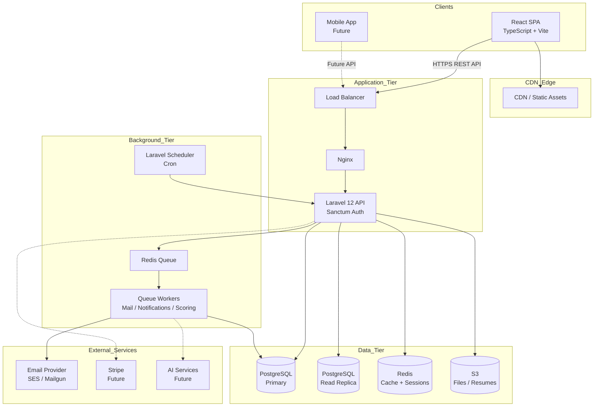

### 3.1 Request Lifecycle

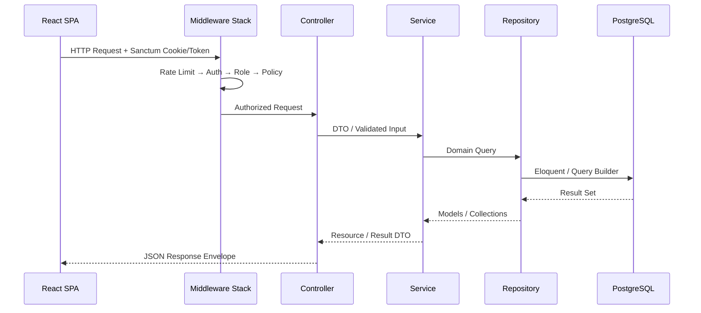

---

## 4. Complete Database Design

### 4.1 Design Conventions

| Convention | Rule |
|------------|------|
| Primary Keys | `BIGINT` auto-increment (`id`) |
| UUIDs | `uuid` column on externally exposed entities (jobs, applications) |
| Timestamps | `created_at`, `updated_at` on all tables |
| Soft Deletes | `deleted_at` on user-facing entities |
| Audit Fields | `created_by`, `updated_by` where ownership matters |
| Enums | PostgreSQL native `ENUM` types or Laravel backed enums |
| JSON Columns | `jsonb` for flexible metadata (resume sections, settings) |
| Indexing | B-tree on FKs; GIN on `jsonb` and full-text; composite indexes on filter columns |
| Naming | `snake_case` plural table names; `snake_case` columns |

### 4.2 Enum Definitions

| Enum | Values |
|------|--------|
| `user_status` | `active`, `inactive`, `suspended`, `pending_verification` |
| `verification_status` | `pending`, `under_review`, `approved`, `rejected`, `resubmission_required` |
| `job_status` | `draft`, `published`, `closed`, `archived` |
| `employment_type` | `full_time`, `part_time`, `contract`, `internship`, `temporary`, `freelance` |
| `work_mode` | `onsite`, `remote`, `hybrid` |
| `application_status` | `submitted`, `under_review`, `shortlisted`, `interview_scheduled`, `interviewed`, `offered`, `hired`, `rejected`, `withdrawn` |
| `interview_status` | `scheduled`, `confirmed`, `completed`, `cancelled`, `no_show`, `rescheduled` |
| `interview_type` | `phone`, `video`, `onsite`, `technical`, `panel`, `hr` |
| `notification_channel` | `database`, `mail`, `push` |
| `notification_type` | `application_status`, `interview_scheduled`, `interview_reminder`, `job_match`, `verification_update`, `system` |
| `file_type` | `resume`, `cover_letter`, `company_logo`, `company_document`, `profile_photo`, `other` |
| `audit_action` | `created`, `updated`, `deleted`, `restored`, `login`, `logout`, `exported` |
| `subscription_status` | `trialing`, `active`, `past_due`, `cancelled`, `expired` *(future)* |

### 4.3 Full-Text Search Strategy

- `jobs`: GIN index on `to_tsvector('english', title || ' ' || description || ' ' || requirements)`
- `job_seeker_profiles`: GIN index on skills + headline + summary
- Phase 3+: optional Elasticsearch sync via queued indexer

### 4.4 Partitioning Strategy (Scale)

| Table | Strategy | Trigger |
|-------|----------|---------|
| `audit_logs` | Range partition by `created_at` (monthly) | > 10M rows |
| `activity_logs` | Range partition by `created_at` (monthly) | > 10M rows |
| `notifications` | Archive rows older than 90 days to cold storage | > 5M rows |

---

## 5. ERD

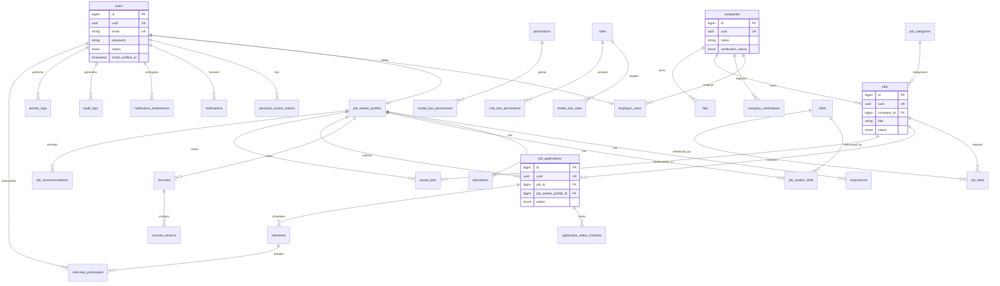

---

## 6. All Database Tables

### 6.1 Authentication & Authorization

#### `users`

| Column | Type | Constraints | Description |
|--------|------|-------------|-------------|
| id | BIGINT | PK, AUTO | Internal ID |
| uuid | UUID | UNIQUE, NOT NULL | Public identifier |
| first_name | VARCHAR(100) | NOT NULL | |
| last_name | VARCHAR(100) | NOT NULL | |
| email | VARCHAR(255) | UNIQUE, NOT NULL | Login identifier |
| email_verified_at | TIMESTAMP | NULLABLE | |
| password | VARCHAR(255) | NOT NULL | Bcrypt hashed |
| phone | VARCHAR(20) | NULLABLE | |
| avatar_file_id | BIGINT | FK → files, NULLABLE | Profile photo |
| status | user_status | DEFAULT `pending_verification` | |
| last_login_at | TIMESTAMP | NULLABLE | |
| last_login_ip | INET | NULLABLE | |
| timezone | VARCHAR(50) | DEFAULT `UTC` | |
| locale | VARCHAR(10) | DEFAULT `en` | Future i18n |
| remember_token | VARCHAR(100) | NULLABLE | |
| created_at | TIMESTAMP | NOT NULL | |
| updated_at | TIMESTAMP | NOT NULL | |
| deleted_at | TIMESTAMP | NULLABLE | Soft delete |

**Indexes:** `email`, `uuid`, `status`, `deleted_at`

---

#### `password_reset_tokens`

| Column | Type | Constraints |
|--------|------|-------------|
| email | VARCHAR(255) | PK |
| token | VARCHAR(255) | NOT NULL |
| created_at | TIMESTAMP | NULLABLE |

---

#### `personal_access_tokens` *(Sanctum)*

| Column | Type | Constraints |
|--------|------|-------------|
| id | BIGINT | PK |
| tokenable_type | VARCHAR(255) | NOT NULL |
| tokenable_id | BIGINT | NOT NULL |
| name | VARCHAR(255) | NOT NULL |
| token | VARCHAR(64) | UNIQUE |
| abilities | TEXT | NULLABLE |
| last_used_at | TIMESTAMP | NULLABLE |
| expires_at | TIMESTAMP | NULLABLE |
| created_at | TIMESTAMP | |
| updated_at | TIMESTAMP | |

---

#### `roles` *(Spatie Permission)*

| Column | Type | Constraints |
|--------|------|-------------|
| id | BIGINT | PK |
| name | VARCHAR(255) | UNIQUE |
| guard_name | VARCHAR(255) | DEFAULT `web` |
| created_at | TIMESTAMP | |
| updated_at | TIMESTAMP | |

**Seed roles:** `admin`, `employer`, `job_seeker`

---

#### `permissions` *(Spatie Permission)*

| Column | Type | Constraints |
|--------|------|-------------|
| id | BIGINT | PK |
| name | VARCHAR(255) | UNIQUE |
| guard_name | VARCHAR(255) | |
| created_at | TIMESTAMP | |
| updated_at | TIMESTAMP | |

---

#### `model_has_roles`, `model_has_permissions`, `role_has_permissions`

Standard Spatie Permission pivot tables linking users to roles and permissions.

---

### 6.2 Employer Domain

#### `companies`

| Column | Type | Constraints | Description |
|--------|------|-------------|-------------|
| id | BIGINT | PK | |
| uuid | UUID | UNIQUE | Public ID |
| name | VARCHAR(255) | NOT NULL | Company name |
| slug | VARCHAR(255) | UNIQUE | URL-friendly |
| description | TEXT | NULLABLE | About company |
| website | VARCHAR(255) | NULLABLE | |
| industry | VARCHAR(100) | NULLABLE | |
| company_size | VARCHAR(50) | NULLABLE | e.g. `1-10`, `11-50` |
| founded_year | SMALLINT | NULLABLE | |
| headquarters | VARCHAR(255) | NULLABLE | |
| logo_file_id | BIGINT | FK → files | |
| verification_status | verification_status | DEFAULT `pending` | |
| verified_at | TIMESTAMP | NULLABLE | |
| verified_by | BIGINT | FK → users, NULLABLE | Admin who approved |
| social_links | JSONB | NULLABLE | `{linkedin, twitter, ...}` |
| settings | JSONB | NULLABLE | Company-level prefs |
| created_by | BIGINT | FK → users | |
| updated_by | BIGINT | FK → users, NULLABLE | |
| created_at | TIMESTAMP | | |
| updated_at | TIMESTAMP | | |
| deleted_at | TIMESTAMP | NULLABLE | |

**Indexes:** `slug`, `verification_status`, `industry`, `deleted_at`

---

#### `employer_users`

| Column | Type | Constraints | Description |
|--------|------|-------------|-------------|
| id | BIGINT | PK | |
| user_id | BIGINT | FK → users, UNIQUE | One user → one employer membership per company |
| company_id | BIGINT | FK → companies | |
| job_title | VARCHAR(100) | NULLABLE | Role at company |
| is_primary | BOOLEAN | DEFAULT false | Primary contact |
| is_active | BOOLEAN | DEFAULT true | |
| invited_by | BIGINT | FK → users, NULLABLE | |
| joined_at | TIMESTAMP | NULLABLE | |
| created_at | TIMESTAMP | | |
| updated_at | TIMESTAMP | | |
| deleted_at | TIMESTAMP | NULLABLE | |

**Indexes:** `(company_id, user_id)` UNIQUE, `is_active`

---

#### `company_verifications`

| Column | Type | Constraints | Description |
|--------|------|-------------|-------------|
| id | BIGINT | PK | |
| company_id | BIGINT | FK → companies | |
| submitted_by | BIGINT | FK → users | |
| status | verification_status | DEFAULT `pending` | |
| business_registration_number | VARCHAR(100) | NULLABLE | |
| tax_id | VARCHAR(100) | NULLABLE | |
| documents | JSONB | NULLABLE | Array of file IDs |
| notes | TEXT | NULLABLE | Employer submission notes |
| reviewer_id | BIGINT | FK → users, NULLABLE | Admin reviewer |
| reviewer_notes | TEXT | NULLABLE | Internal admin notes |
| rejection_reason | TEXT | NULLABLE | Shown to employer |
| reviewed_at | TIMESTAMP | NULLABLE | |
| created_at | TIMESTAMP | | |
| updated_at | TIMESTAMP | | |

**Indexes:** `company_id`, `status`, `submitted_by`

---

### 6.3 Job Seeker Domain

#### `job_seeker_profiles`

| Column | Type | Constraints | Description |
|--------|------|-------------|-------------|
| id | BIGINT | PK | |
| uuid | UUID | UNIQUE | |
| user_id | BIGINT | FK → users, UNIQUE | |
| headline | VARCHAR(255) | NULLABLE | Professional headline |
| summary | TEXT | NULLABLE | Bio / summary |
| current_title | VARCHAR(150) | NULLABLE | |
| years_of_experience | DECIMAL(4,1) | NULLABLE | |
| expected_salary_min | DECIMAL(12,2) | NULLABLE | |
| expected_salary_max | DECIMAL(12,2) | NULLABLE | |
| salary_currency | VARCHAR(3) | DEFAULT `USD` | |
| preferred_work_mode | work_mode | NULLABLE | |
| preferred_employment_type | employment_type | NULLABLE | |
| willing_to_relocate | BOOLEAN | DEFAULT false | |
| location_city | VARCHAR(100) | NULLABLE | |
| location_state | VARCHAR(100) | NULLABLE | |
| location_country | VARCHAR(100) | NULLABLE | |
| linkedin_url | VARCHAR(255) | NULLABLE | |
| portfolio_url | VARCHAR(255) | NULLABLE | |
| profile_completion | SMALLINT | DEFAULT 0 | 0–100 percentage |
| is_open_to_work | BOOLEAN | DEFAULT true | |
| is_profile_public | BOOLEAN | DEFAULT true | |
| resume_file_id | BIGINT | FK → files, NULLABLE | Primary uploaded resume |
| created_at | TIMESTAMP | | |
| updated_at | TIMESTAMP | | |
| deleted_at | TIMESTAMP | NULLABLE | |

**Indexes:** `user_id`, `is_open_to_work`, `location_country`, `profile_completion`

---

#### `skills`

| Column | Type | Constraints |
|--------|------|-------------|
| id | BIGINT | PK |
| name | VARCHAR(100) | UNIQUE |
| slug | VARCHAR(100) | UNIQUE |
| category | VARCHAR(50) | NULLABLE |
| created_at | TIMESTAMP | |
| updated_at | TIMESTAMP | |

---

#### `job_seeker_skills`

| Column | Type | Constraints |
|--------|------|-------------|
| id | BIGINT | PK |
| job_seeker_profile_id | BIGINT | FK |
| skill_id | BIGINT | FK |
| proficiency_level | SMALLINT | 1–5 |
| years_of_experience | DECIMAL(4,1) | NULLABLE |
| created_at | TIMESTAMP | |
| updated_at | TIMESTAMP | |

**Indexes:** `(job_seeker_profile_id, skill_id)` UNIQUE

---

#### `experiences`

| Column | Type | Constraints |
|--------|------|-------------|
| id | BIGINT | PK |
| job_seeker_profile_id | BIGINT | FK |
| company_name | VARCHAR(255) | NOT NULL |
| job_title | VARCHAR(150) | NOT NULL |
| employment_type | employment_type | NULLABLE |
| location | VARCHAR(255) | NULLABLE |
| description | TEXT | NULLABLE |
| started_at | DATE | NOT NULL |
| ended_at | DATE | NULLABLE |
| is_current | BOOLEAN | DEFAULT false |
| sort_order | SMALLINT | DEFAULT 0 |
| created_at | TIMESTAMP | |
| updated_at | TIMESTAMP | |
| deleted_at | TIMESTAMP | NULLABLE |

**Indexes:** `job_seeker_profile_id`, `is_current`

---

#### `educations`

| Column | Type | Constraints |
|--------|------|-------------|
| id | BIGINT | PK |
| job_seeker_profile_id | BIGINT | FK |
| institution | VARCHAR(255) | NOT NULL |
| degree | VARCHAR(150) | NOT NULL |
| field_of_study | VARCHAR(150) | NULLABLE |
| grade | VARCHAR(50) | NULLABLE |
| description | TEXT | NULLABLE |
| started_at | DATE | NULLABLE |
| ended_at | DATE | NULLABLE |
| is_current | BOOLEAN | DEFAULT false |
| sort_order | SMALLINT | DEFAULT 0 |
| created_at | TIMESTAMP | |
| updated_at | TIMESTAMP | |
| deleted_at | TIMESTAMP | NULLABLE |

**Indexes:** `job_seeker_profile_id`

---

#### `resumes`

| Column | Type | Constraints | Description |
|--------|------|-------------|-------------|
| id | BIGINT | PK | |
| uuid | UUID | UNIQUE | |
| job_seeker_profile_id | BIGINT | FK | |
| title | VARCHAR(255) | NOT NULL | Resume name |
| template_key | VARCHAR(50) | DEFAULT `classic` | Builder template |
| is_primary | BOOLEAN | DEFAULT false | |
| source | VARCHAR(20) | `upload` or `builder` | |
| file_id | BIGINT | FK → files, NULLABLE | Generated PDF |
| metadata | JSONB | NULLABLE | Builder state snapshot |
| created_at | TIMESTAMP | | |
| updated_at | TIMESTAMP | | |
| deleted_at | TIMESTAMP | NULLABLE | |

**Indexes:** `job_seeker_profile_id`, `is_primary`

---

#### `resume_sections`

| Column | Type | Constraints | Description |
|--------|------|-------------|-------------|
| id | BIGINT | PK | |
| resume_id | BIGINT | FK → resumes | |
| section_type | VARCHAR(50) | NOT NULL | `summary`, `experience`, `education`, `skills`, `custom` |
| title | VARCHAR(150) | NULLABLE | Section heading |
| content | JSONB | NOT NULL | Structured section data |
| sort_order | SMALLINT | DEFAULT 0 | |
| is_visible | BOOLEAN | DEFAULT true | |
| created_at | TIMESTAMP | | |
| updated_at | TIMESTAMP | | |

**Indexes:** `resume_id`, `(resume_id, sort_order)`

---

### 6.4 Job Domain

#### `job_categories`

| Column | Type | Constraints |
|--------|------|-------------|
| id | BIGINT | PK |
| name | VARCHAR(100) | UNIQUE |
| slug | VARCHAR(100) | UNIQUE |
| parent_id | BIGINT | FK → job_categories, NULLABLE |
| sort_order | SMALLINT | DEFAULT 0 |
| is_active | BOOLEAN | DEFAULT true |
| created_at | TIMESTAMP | |
| updated_at | TIMESTAMP | |

---

#### `jobs`

| Column | Type | Constraints | Description |
|--------|------|-------------|-------------|
| id | BIGINT | PK | |
| uuid | UUID | UNIQUE | |
| company_id | BIGINT | FK → companies | |
| category_id | BIGINT | FK → job_categories, NULLABLE | |
| title | VARCHAR(255) | NOT NULL | |
| slug | VARCHAR(255) | NOT NULL | |
| description | TEXT | NOT NULL | |
| requirements | TEXT | NULLABLE | |
| responsibilities | TEXT | NULLABLE | |
| benefits | TEXT | NULLABLE | |
| employment_type | employment_type | NOT NULL | |
| work_mode | work_mode | NOT NULL | |
| experience_level | VARCHAR(50) | NULLABLE | `entry`, `mid`, `senior`, `lead` |
| salary_min | DECIMAL(12,2) | NULLABLE | |
| salary_max | DECIMAL(12,2) | NULLABLE | |
| salary_currency | VARCHAR(3) | DEFAULT `USD` | |
| salary_period | VARCHAR(20) | DEFAULT `yearly` | |
| is_salary_visible | BOOLEAN | DEFAULT false | |
| location_city | VARCHAR(100) | NULLABLE | |
| location_state | VARCHAR(100) | NULLABLE | |
| location_country | VARCHAR(100) | NULLABLE | |
| application_deadline | DATE | NULLABLE | |
| vacancies | SMALLINT | DEFAULT 1 | |
| status | job_status | DEFAULT `draft` | |
| published_at | TIMESTAMP | NULLABLE | |
| closed_at | TIMESTAMP | NULLABLE | |
| views_count | INTEGER | DEFAULT 0 | |
| applications_count | INTEGER | DEFAULT 0 | Denormalized counter |
| created_by | BIGINT | FK → users | |
| updated_by | BIGINT | FK → users, NULLABLE | |
| created_at | TIMESTAMP | | |
| updated_at | TIMESTAMP | | |
| deleted_at | TIMESTAMP | NULLABLE | |

**Indexes:** `company_id`, `status`, `slug`, `(location_country, status)`, `published_at`, `employment_type`, `work_mode`, GIN full-text

---

#### `job_skills`

| Column | Type | Constraints |
|--------|------|-------------|
| id | BIGINT | PK |
| job_id | BIGINT | FK |
| skill_id | BIGINT | FK |
| is_required | BOOLEAN | DEFAULT true |
| created_at | TIMESTAMP | |

**Indexes:** `(job_id, skill_id)` UNIQUE

---

### 6.5 Application & Interview Domain

#### `job_applications`

| Column | Type | Constraints | Description |
|--------|------|-------------|-------------|
| id | BIGINT | PK | |
| uuid | UUID | UNIQUE | |
| job_id | BIGINT | FK → jobs | |
| job_seeker_profile_id | BIGINT | FK | |
| resume_id | BIGINT | FK → resumes, NULLABLE | Resume used |
| cover_letter | TEXT | NULLABLE | |
| status | application_status | DEFAULT `submitted` | |
| employer_notes | TEXT | NULLABLE | Internal |
| rejection_reason | TEXT | NULLABLE | |
| applied_at | TIMESTAMP | NOT NULL | |
| status_changed_at | TIMESTAMP | NULLABLE | |
| created_at | TIMESTAMP | | |
| updated_at | TIMESTAMP | | |
| deleted_at | TIMESTAMP | NULLABLE | |

**Indexes:** `(job_id, job_seeker_profile_id)` UNIQUE, `status`, `applied_at`, `job_seeker_profile_id`

---

#### `application_status_histories`

| Column | Type | Constraints |
|--------|------|-------------|
| id | BIGINT | PK |
| job_application_id | BIGINT | FK |
| from_status | application_status | NULLABLE |
| to_status | application_status | NOT NULL |
| changed_by | BIGINT | FK → users |
| notes | TEXT | NULLABLE |
| created_at | TIMESTAMP | NOT NULL |

**Indexes:** `job_application_id`, `created_at`

---

#### `saved_jobs`

| Column | Type | Constraints |
|--------|------|-------------|
| id | BIGINT | PK |
| job_seeker_profile_id | BIGINT | FK |
| job_id | BIGINT | FK |
| created_at | TIMESTAMP | |

**Indexes:** `(job_seeker_profile_id, job_id)` UNIQUE

---

#### `interviews`

| Column | Type | Constraints | Description |
|--------|------|-------------|-------------|
| id | BIGINT | PK | |
| uuid | UUID | UNIQUE | |
| job_application_id | BIGINT | FK | |
| company_id | BIGINT | FK → companies | Denormalized for queries |
| scheduled_by | BIGINT | FK → users | |
| interview_type | interview_type | NOT NULL | |
| status | interview_status | DEFAULT `scheduled` | |
| title | VARCHAR(255) | NULLABLE | |
| scheduled_at | TIMESTAMP | NOT NULL | |
| duration_minutes | SMALLINT | DEFAULT 60 | |
| timezone | VARCHAR(50) | NOT NULL | |
| location | VARCHAR(255) | NULLABLE | Onsite address |
| meeting_link | VARCHAR(500) | NULLABLE | Video URL |
| instructions | TEXT | NULLABLE | |
| feedback | TEXT | NULLABLE | Post-interview |
| rating | SMALLINT | NULLABLE | 1–5 |
| completed_at | TIMESTAMP | NULLABLE | |
| cancelled_at | TIMESTAMP | NULLABLE | |
| cancellation_reason | TEXT | NULLABLE | |
| created_at | TIMESTAMP | | |
| updated_at | TIMESTAMP | | |
| deleted_at | TIMESTAMP | NULLABLE | |

**Indexes:** `job_application_id`, `company_id`, `scheduled_at`, `status`

---

#### `interview_participants`

| Column | Type | Constraints |
|--------|------|-------------|
| id | BIGINT | PK |
| interview_id | BIGINT | FK |
| user_id | BIGINT | FK → users |
| role | VARCHAR(50) | `interviewer`, `candidate`, `observer` |
| response_status | VARCHAR(20) | `pending`, `accepted`, `declined` |
| created_at | TIMESTAMP | |
| updated_at | TIMESTAMP | |

**Indexes:** `(interview_id, user_id)` UNIQUE

---

### 6.6 Platform Domain

#### `files`

| Column | Type | Constraints | Description |
|--------|------|-------------|-------------|
| id | BIGINT | PK | |
| uuid | UUID | UNIQUE | |
| uploaded_by | BIGINT | FK → users | |
| disk | VARCHAR(50) | DEFAULT `s3` | |
| path | VARCHAR(500) | NOT NULL | Storage path |
| original_name | VARCHAR(255) | NOT NULL | |
| mime_type | VARCHAR(100) | NOT NULL | |
| size_bytes | BIGINT | NOT NULL | |
| file_type | file_type | NOT NULL | |
| entity_type | VARCHAR(100) | NULLABLE | Polymorphic owner |
| entity_id | BIGINT | NULLABLE | |
| checksum | VARCHAR(64) | NULLABLE | SHA-256 |
| metadata | JSONB | NULLABLE | |
| created_at | TIMESTAMP | | |
| updated_at | TIMESTAMP | | |
| deleted_at | TIMESTAMP | NULLABLE | |

**Indexes:** `uploaded_by`, `(entity_type, entity_id)`, `file_type`

---

#### `notifications`

| Column | Type | Constraints |
|--------|------|-------------|
| id | UUID | PK |
| type | VARCHAR(255) | NOT NULL |
| notifiable_type | VARCHAR(255) | |
| notifiable_id | BIGINT | |
| data | JSONB | NOT NULL |
| read_at | TIMESTAMP | NULLABLE |
| created_at | TIMESTAMP | |
| updated_at | TIMESTAMP | |

**Indexes:** `(notifiable_type, notifiable_id)`, `read_at`, `created_at`

---

#### `notification_preferences`

| Column | Type | Constraints |
|--------|------|-------------|
| id | BIGINT | PK |
| user_id | BIGINT | FK → users | |
| notification_type | notification_type | NOT NULL | |
| channel_mail | BOOLEAN | DEFAULT true | |
| channel_database | BOOLEAN | DEFAULT true | |
| channel_push | BOOLEAN | DEFAULT false | |
| created_at | TIMESTAMP | |
| updated_at | TIMESTAMP | |

**Indexes:** `(user_id, notification_type)` UNIQUE

---

#### `job_recommendations`

| Column | Type | Constraints | Description |
|--------|------|-------------|-------------|
| id | BIGINT | PK | |
| job_seeker_profile_id | BIGINT | FK | |
| job_id | BIGINT | FK | |
| score | DECIMAL(5,2) | NOT NULL | 0.00–100.00 |
| reason | JSONB | NULLABLE | `{matched_skills: [], ...}` |
| is_dismissed | BOOLEAN | DEFAULT false | |
| is_viewed | BOOLEAN | DEFAULT false | |
| generated_at | TIMESTAMP | NOT NULL | |
| expires_at | TIMESTAMP | NULLABLE | |
| created_at | TIMESTAMP | |
| updated_at | TIMESTAMP | |

**Indexes:** `(job_seeker_profile_id, job_id)` UNIQUE, `score DESC`, `generated_at`

---

#### `audit_logs`

| Column | Type | Constraints |
|--------|------|-------------|
| id | BIGINT | PK |
| user_id | BIGINT | FK → users, NULLABLE |
| action | audit_action | NOT NULL |
| auditable_type | VARCHAR(100) | NOT NULL |
| auditable_id | BIGINT | NOT NULL |
| old_values | JSONB | NULLABLE |
| new_values | JSONB | NULLABLE |
| ip_address | INET | NULLABLE |
| user_agent | TEXT | NULLABLE |
| created_at | TIMESTAMP | NOT NULL |

**Indexes:** `user_id`, `(auditable_type, auditable_id)`, `action`, `created_at`

---

#### `activity_logs`

| Column | Type | Constraints | Description |
|--------|------|-------------|-------------|
| id | BIGINT | PK | |
| user_id | BIGINT | FK → users, NULLABLE | |
| company_id | BIGINT | FK, NULLABLE | Employer context |
| activity_type | VARCHAR(100) | NOT NULL | e.g. `job.posted` |
| description | TEXT | NOT NULL | Human-readable |
| subject_type | VARCHAR(100) | NULLABLE | |
| subject_id | BIGINT | NULLABLE | |
| properties | JSONB | NULLABLE | |
| created_at | TIMESTAMP | NOT NULL | |

**Indexes:** `user_id`, `company_id`, `activity_type`, `created_at`

---

#### `system_settings`

| Column | Type | Constraints |
|--------|------|-------------|
| id | BIGINT | PK |
| key | VARCHAR(100) | UNIQUE |
| value | JSONB | NOT NULL |
| group | VARCHAR(50) | `general`, `email`, `security` |
| description | TEXT | NULLABLE |
| updated_by | BIGINT | FK → users, NULLABLE |
| created_at | TIMESTAMP | |
| updated_at | TIMESTAMP | |

---

### 6.7 Future Tables (Design Only)

#### `subscription_plans` *(future)*

| Column | Type | Description |
|--------|------|-------------|
| id | BIGINT | PK |
| name | VARCHAR | Plan name |
| slug | VARCHAR | UNIQUE |
| stripe_price_id | VARCHAR | Stripe Price ID |
| price_cents | INTEGER | |
| billing_interval | VARCHAR | `month`, `year` |
| features | JSONB | Feature flags/limits |
| is_active | BOOLEAN | |

#### `subscriptions` *(future)*

Links `company_id` to `subscription_plans` with `subscription_status`, `stripe_subscription_id`, trial/billing dates.

#### `payments` *(future)*

Stripe payment records linked to subscriptions.

#### `ai_analysis_results` *(future)*

Resume analysis and job match AI outputs with `entity_type`, `entity_id`, `analysis_type`, `result` JSONB.

#### `translations` *(future)*

i18n key-value store or reference to external translation service.

---

## 7. Table Relationships

### 7.1 Relationship Matrix

| Parent Table | Child Table | Relationship | FK Column | On Delete |
|--------------|-------------|--------------|-----------|-----------|
| users | job_seeker_profiles | 1:1 | user_id | CASCADE |
| users | employer_users | 1:N | user_id | CASCADE |
| users | files | 1:N | uploaded_by | SET NULL |
| users | audit_logs | 1:N | user_id | SET NULL |
| users | activity_logs | 1:N | user_id | SET NULL |
| users | notifications | 1:N (polymorphic) | notifiable_id | CASCADE |
| users | notification_preferences | 1:N | user_id | CASCADE |
| companies | employer_users | 1:N | company_id | CASCADE |
| companies | company_verifications | 1:N | company_id | CASCADE |
| companies | jobs | 1:N | company_id | RESTRICT |
| companies | interviews | 1:N | company_id | CASCADE |
| job_seeker_profiles | experiences | 1:N | job_seeker_profile_id | CASCADE |
| job_seeker_profiles | educations | 1:N | job_seeker_profile_id | CASCADE |
| job_seeker_profiles | job_seeker_skills | 1:N | job_seeker_profile_id | CASCADE |
| job_seeker_profiles | resumes | 1:N | job_seeker_profile_id | CASCADE |
| job_seeker_profiles | job_applications | 1:N | job_seeker_profile_id | RESTRICT |
| job_seeker_profiles | saved_jobs | 1:N | job_seeker_profile_id | CASCADE |
| job_seeker_profiles | job_recommendations | 1:N | job_seeker_profile_id | CASCADE |
| skills | job_seeker_skills | 1:N | skill_id | RESTRICT |
| skills | job_skills | 1:N | skill_id | RESTRICT |
| resumes | resume_sections | 1:N | resume_id | CASCADE |
| resumes | job_applications | 1:N | resume_id | SET NULL |
| job_categories | jobs | 1:N | category_id | SET NULL |
| job_categories | job_categories | 1:N (self) | parent_id | SET NULL |
| jobs | job_skills | 1:N | job_id | CASCADE |
| jobs | job_applications | 1:N | job_id | RESTRICT |
| jobs | saved_jobs | 1:N | job_id | CASCADE |
| jobs | job_recommendations | 1:N | job_id | CASCADE |
| job_applications | application_status_histories | 1:N | job_application_id | CASCADE |
| job_applications | interviews | 1:N | job_application_id | CASCADE |
| interviews | interview_participants | 1:N | interview_id | CASCADE |
| files | users (avatar) | 1:1 | avatar_file_id | SET NULL |
| files | companies (logo) | 1:1 | logo_file_id | SET NULL |
| files | resumes | 1:1 | file_id | SET NULL |

### 7.2 Cardinality Rules

- A **user** has exactly one role assignment set (admin OR employer OR job_seeker primary role).
- A **user** with role `job_seeker` has exactly one `job_seeker_profile`.
- A **user** with role `employer` has one or more `employer_users` records (one per company).
- A **job_seeker** may apply to a **job** only once (unique constraint).
- A **job** belongs to exactly one **company**; deleting a company with active jobs is blocked (RESTRICT).
- **Interviews** always link to a **job_application** (never standalone).

### 7.3 Referential Integrity Notes

- All FK constraints enforced at database level, not application-only.
- Soft-deleted parents remain referentially valid; application layer filters `deleted_at IS NULL`.
- Denormalized counters (`jobs.applications_count`, `jobs.views_count`) updated via events/observers.

---

## 8. Folder Structure

```
TalentBridge/
├── app/
│   ├── Console/
│   │   └── Commands/
│   ├── Enums/
│   ├── Events/
│   ├── Exceptions/
│   ├── Http/
│   │   ├── Controllers/
│   │   │   └── Api/
│   │   │       └── V1/
│   │   ├── Middleware/
│   │   ├── Requests/
│   │   │   └── Api/
│   │   │       └── V1/
│   │   └── Resources/
│   │       └── Api/
│   │           └── V1/
│   ├── Jobs/
│   ├── Listeners/
│   ├── Models/
│   ├── Modules/                    # Feature modules (see §9)
│   ├── Policies/
│   ├── Providers/
│   ├── Repositories/
│   │   └── Contracts/
│   ├── Rules/
│   ├── Services/
│   │   └── Contracts/
│   └── Traits/
├── bootstrap/
├── config/
│   ├── cors.php
│   ├── permission.php
│   ├── sanctum.php
│   └── talentbridge.php            # App-specific config
├── database/
│   ├── factories/
│   ├── migrations/
│   └── seeders/
├── docs/
│   └── architecture.md             # This document
├── public/
├── resources/
│   ├── js/                         # React SPA root (see §10)
│   │   ├── app.tsx
│   │   ├── main.tsx
│   │   └── ...
│   └── views/
│       └── app.blade.php           # SPA shell
├── routes/
│   ├── api.php
│   ├── channels.php
│   └── web.php
├── storage/
├── tests/
│   ├── Feature/
│   │   └── Api/
│   └── Unit/
├── .env.example
├── composer.json
├── package.json
├── phpunit.xml
├── tailwind.config.js
├── tsconfig.json
└── vite.config.ts
```

---

## 9. Backend Module Structure

Each module is self-contained under `app/Modules/{ModuleName}/` following Clean Architecture.

```
app/Modules/
├── Auth/
│   ├── Controllers/
│   ├── Requests/
│   ├── Resources/
│   ├── Services/
│   │   ├── AuthService.php
│   │   ├── PasswordResetService.php
│   │   └── EmailVerificationService.php
│   ├── Repositories/
│   └── Events/
├── User/
│   ├── Controllers/
│   ├── Services/
│   ├── Repositories/
│   └── Resources/
├── Employer/
│   ├── Controllers/
│   ├── Services/
│   │   ├── CompanyService.php
│   │   ├── CompanyVerificationService.php
│   │   └── EmployerDashboardService.php
│   ├── Repositories/
│   ├── Policies/
│   └── Resources/
├── JobSeeker/
│   ├── Controllers/
│   ├── Services/
│   │   ├── ProfileService.php
│   │   ├── ExperienceService.php
│   │   ├── EducationService.php
│   │   └── SkillService.php
│   ├── Repositories/
│   └── Resources/
├── Job/
│   ├── Controllers/
│   ├── Services/
│   │   ├── JobService.php
│   │   ├── JobSearchService.php
│   │   └── JobPublishService.php
│   ├── Repositories/
│   ├── Policies/
│   └── Resources/
├── Application/
│   ├── Controllers/
│   ├── Services/
│   │   ├── ApplicationService.php
│   │   └── ApplicationStatusService.php
│   ├── Repositories/
│   ├── Policies/
│   └── Events/
├── Interview/
│   ├── Controllers/
│   ├── Services/
│   │   └── InterviewService.php
│   ├── Repositories/
│   ├── Policies/
│   └── Resources/
├── Resume/
│   ├── Controllers/
│   ├── Services/
│   │   ├── ResumeUploadService.php
│   │   ├── ResumeBuilderService.php
│   │   └── ResumeExportService.php
│   ├── Repositories/
│   └── Resources/
├── Notification/
│   ├── Controllers/
│   ├── Services/
│   │   ├── NotificationService.php
│   │   └── NotificationPreferenceService.php
│   ├── Repositories/
│   ├── Notifications/              # Laravel Notification classes
│   └── Channels/
├── Recommendation/
│   ├── Controllers/
│   ├── Services/
│   │   └── JobRecommendationService.php
│   ├── Repositories/
│   └── Jobs/
├── Admin/
│   ├── Controllers/
│   ├── Services/
│   │   ├── AdminDashboardService.php
│   │   ├── UserManagementService.php
│   │   ├── VerificationManagementService.php
│   │   └── AnalyticsService.php
│   └── Resources/
├── File/
│   ├── Controllers/
│   ├── Services/
│   │   └── FileUploadService.php
│   └── Repositories/
├── Audit/
│   ├── Services/
│   │   ├── AuditLogService.php
│   │   └── ActivityLogService.php
│   ├── Repositories/
│   └── Observers/
└── Shared/
    ├── DTOs/
    ├── Enums/
    ├── Traits/
    │   ├── HasUuid.php
    │   ├── Auditable.php
    │   └── HasAuditFields.php
    └── Helpers/
```

### 9.1 Module Registration

Each module exposes a `{Module}ServiceProvider` that registers:
- Route definitions (loaded in `routes/api.php`)
- Policy bindings
- Event listeners
- Repository interface → implementation bindings

### 9.2 Service Layer Contract

```
Controller → FormRequest (validation) → Service (business logic) → Repository (data access) → Model
```

- **Controllers:** Thin; only orchestrate request/response.
- **Services:** All business rules, transactions, event dispatch.
- **Repositories:** Query abstraction; no business logic.
- **DTOs:** Transfer data between layers without exposing models.

---

## 10. Frontend Module Structure

```
resources/js/
├── app.tsx                         # Root app with providers
├── main.tsx                        # Vite entry
├── vite-env.d.ts
│
├── components/                     # Shared UI (ShadCN-based)
│   ├── ui/                         # ShadCN primitives
│   ├── layout/
│   │   ├── AppLayout.tsx
│   │   ├── AdminLayout.tsx
│   │   ├── EmployerLayout.tsx
│   │   ├── JobSeekerLayout.tsx
│   │   ├── AuthLayout.tsx
│   │   ├── Sidebar.tsx
│   │   ├── Header.tsx
│   │   └── Footer.tsx
│   ├── common/
│   │   ├── DataTable.tsx
│   │   ├── Pagination.tsx
│   │   ├── SearchInput.tsx
│   │   ├── FileUpload.tsx
│   │   ├── StatusBadge.tsx
│   │   ├── EmptyState.tsx
│   │   ├── LoadingSpinner.tsx
│   │   ├── ConfirmDialog.tsx
│   │   └── ErrorBoundary.tsx
│   └── forms/
│       ├── FormField.tsx
│       └── RichTextEditor.tsx
│
├── features/                       # Feature modules
│   ├── auth/
│   │   ├── api/
│   │   ├── components/
│   │   ├── hooks/
│   │   ├── pages/
│   │   │   ├── LoginPage.tsx
│   │   │   ├── RegisterPage.tsx
│   │   │   ├── ForgotPasswordPage.tsx
│   │   │   ├── ResetPasswordPage.tsx
│   │   │   └── VerifyEmailPage.tsx
│   │   ├── types/
│   │   └── schemas/                # Zod validation schemas
│   ├── admin/
│   │   ├── api/
│   │   ├── components/
│   │   ├── hooks/
│   │   └── pages/
│   │       ├── DashboardPage.tsx
│   │       ├── UsersPage.tsx
│   │       ├── EmployersPage.tsx
│   │       ├── JobSeekersPage.tsx
│   │       ├── JobsPage.tsx
│   │       ├── InterviewsPage.tsx
│   │       ├── VerificationsPage.tsx
│   │       ├── AnalyticsPage.tsx
│   │       ├── ActivityLogsPage.tsx
│   │       └── SettingsPage.tsx
│   ├── employer/
│   │   ├── api/
│   │   ├── components/
│   │   ├── hooks/
│   │   └── pages/
│   │       ├── DashboardPage.tsx
│   │       ├── CompanyProfilePage.tsx
│   │       ├── VerificationPage.tsx
│   │       ├── JobsPage.tsx
│   │       ├── JobCreatePage.tsx
│   │       ├── JobEditPage.tsx
│   │       ├── ApplicantsPage.tsx
│   │       ├── ApplicantDetailPage.tsx
│   │       ├── InterviewsPage.tsx
│   │       └── AnalyticsPage.tsx
│   ├── job-seeker/
│   │   ├── api/
│   │   ├── components/
│   │   ├── hooks/
│   │   └── pages/
│   │       ├── DashboardPage.tsx
│   │       ├── ProfilePage.tsx
│   │       ├── ResumePage.tsx
│   │       ├── ResumeBuilderPage.tsx
│   │       ├── JobSearchPage.tsx
│   │       ├── JobDetailPage.tsx
│   │       ├── ApplicationsPage.tsx
│   │       ├── SavedJobsPage.tsx
│   │       ├── InterviewsPage.tsx
│   │       └── RecommendationsPage.tsx
│   ├── jobs/                       # Public job portal
│   │   ├── api/
│   │   ├── components/
│   │   └── pages/
│   │       ├── JobListPage.tsx
│   │       └── JobDetailPage.tsx
│   └── notifications/
│       ├── api/
│       ├── components/
│       │   ├── NotificationBell.tsx
│       │   ├── NotificationList.tsx
│       │   └── NotificationPreferences.tsx
│       └── hooks/
│
├── hooks/                          # Global hooks
│   ├── useAuth.ts
│   ├── useTheme.ts
│   ├── useDebounce.ts
│   └── useMediaQuery.ts
│
├── lib/                            # Utilities
│   ├── api-client.ts               # Axios instance + interceptors
│   ├── query-client.ts             # TanStack Query config
│   ├── utils.ts                      # cn() and helpers
│   └── constants.ts
│
├── providers/
│   ├── AuthProvider.tsx
│   ├── ThemeProvider.tsx
│   └── QueryProvider.tsx
│
├── routes/
│   ├── index.tsx                   # Route definitions
│   ├── ProtectedRoute.tsx
│   ├── RoleRoute.tsx
│   └── GuestRoute.tsx
│
├── stores/                         # Zustand (minimal global state)
│   └── auth-store.ts
│
├── types/
│   ├── api.ts                      # API response types
│   ├── models.ts                   # Domain model types
│   └── enums.ts
│
└── styles/
    ├── globals.css
    └── themes/
        ├── light.css
        └── dark.css
```

### 10.1 Frontend Conventions

| Convention | Rule |
|------------|------|
| State (server) | TanStack Query for all API data |
| State (client) | Zustand for auth + theme only |
| Forms | React Hook Form + Zod |
| Routing | React Router v7 |
| API calls | Feature `api/` modules using shared `api-client` |
| Components | ShadCN UI primitives; extend in `components/ui/` |
| Pages | One page per route; compose feature components |
| Types | Mirror backend API Resources |

---

## 11. API Structure

### 11.1 Base URL & Versioning

```
Base URL:  /api/v1
Format:    JSON
Auth:      Bearer Token (API) | Sanctum Cookie (SPA)
```

### 11.2 Route Groups

#### Public Routes (no auth)

| Method | Endpoint | Description |
|--------|----------|-------------|
| POST | `/auth/register` | Register user (role in payload) |
| POST | `/auth/login` | Login |
| POST | `/auth/forgot-password` | Send reset link |
| POST | `/auth/reset-password` | Reset password |
| GET | `/jobs` | Public job listing |
| GET | `/jobs/{uuid}` | Public job detail |
| GET | `/companies/{slug}` | Public company profile |
| GET | `/job-categories` | List categories |
| GET | `/skills` | Search skills (autocomplete) |

#### Authenticated Routes (all roles)

| Method | Endpoint | Description |
|--------|----------|-------------|
| POST | `/auth/logout` | Logout |
| GET | `/auth/me` | Current user + role context |
| POST | `/auth/email/verify/resend` | Resend verification |
| GET | `/auth/email/verify/{id}/{hash}` | Verify email |
| PUT | `/auth/password` | Change password |
| GET | `/notifications` | List notifications |
| PATCH | `/notifications/{id}/read` | Mark read |
| POST | `/notifications/read-all` | Mark all read |
| GET | `/notification-preferences` | Get preferences |
| PUT | `/notification-preferences` | Update preferences |
| POST | `/files/upload` | Upload file |
| GET | `/files/{uuid}` | Get signed download URL |
| DELETE | `/files/{uuid}` | Delete file |

#### Job Seeker Routes (`role:job_seeker`)

| Method | Endpoint | Description |
|--------|----------|-------------|
| GET/PUT | `/job-seeker/profile` | Profile CRUD |
| GET/POST/PUT/DELETE | `/job-seeker/experiences` | Experience CRUD |
| GET/POST/PUT/DELETE | `/job-seeker/educations` | Education CRUD |
| GET/POST/DELETE | `/job-seeker/skills` | Skills management |
| GET/POST/PUT/DELETE | `/job-seeker/resumes` | Resume management |
| POST | `/job-seeker/resumes/{uuid}/export` | Export builder → PDF |
| GET | `/job-seeker/applications` | My applications |
| POST | `/jobs/{uuid}/apply` | Apply to job |
| DELETE | `/job-seeker/applications/{uuid}` | Withdraw application |
| GET/POST/DELETE | `/job-seeker/saved-jobs` | Saved jobs |
| GET | `/job-seeker/interviews` | My interviews |
| PATCH | `/job-seeker/interviews/{uuid}/respond` | Accept/decline |
| GET | `/job-seeker/recommendations` | Job recommendations |
| POST | `/job-seeker/recommendations/{id}/dismiss` | Dismiss recommendation |

#### Employer Routes (`role:employer`)

| Method | Endpoint | Description |
|--------|----------|-------------|
| GET/PUT | `/employer/company` | Company profile |
| POST | `/employer/company/verification` | Submit verification |
| GET | `/employer/dashboard` | Dashboard stats |
| GET/POST | `/employer/jobs` | List/create jobs |
| GET/PUT/DELETE | `/employer/jobs/{uuid}` | Job CRUD |
| PATCH | `/employer/jobs/{uuid}/publish` | Publish job |
| PATCH | `/employer/jobs/{uuid}/close` | Close job |
| GET | `/employer/jobs/{uuid}/applicants` | List applicants |
| GET | `/employer/applicants/{uuid}` | Applicant detail |
| PATCH | `/employer/applicants/{uuid}/status` | Update application status |
| GET/POST | `/employer/interviews` | Interview management |
| GET/PUT/DELETE | `/employer/interviews/{uuid}` | Interview CRUD |
| GET | `/employer/analytics` | Employer analytics |

#### Admin Routes (`role:admin`)

| Method | Endpoint | Description |
|--------|----------|-------------|
| GET | `/admin/dashboard` | Admin dashboard |
| GET/POST/PUT/DELETE | `/admin/users` | User management |
| PATCH | `/admin/users/{id}/status` | Activate/suspend user |
| GET | `/admin/employers` | List employers |
| GET | `/admin/job-seekers` | List job seekers |
| GET/PUT/DELETE | `/admin/jobs` | Manage all jobs |
| GET | `/admin/interviews` | Monitor interviews |
| GET | `/admin/verifications` | Verification queue |
| PATCH | `/admin/verifications/{id}` | Approve/reject |
| GET | `/admin/analytics` | Platform analytics |
| GET | `/admin/audit-logs` | Audit logs |
| GET | `/admin/activity-logs` | Activity logs |
| GET/PUT | `/admin/settings` | System settings |

### 11.3 Query Parameters (List Endpoints)

| Parameter | Type | Description |
|-----------|------|-------------|
| `page` | integer | Page number (default: 1) |
| `per_page` | integer | Items per page (default: 15, max: 100) |
| `sort` | string | Sort field |
| `order` | string | `asc` or `desc` |
| `search` | string | Full-text search |
| `filter[field]` | mixed | Field-specific filters |
| `include` | string | Comma-separated relations to eager-load |

### 11.4 Rate Limiting

| Group | Limit |
|-------|-------|
| Auth (login/register) | 5 requests/minute per IP |
| Password reset | 3 requests/minute per email |
| File upload | 10 requests/minute per user |
| General API (authenticated) | 120 requests/minute per user |
| Public job search | 60 requests/minute per IP |

### 11.5 Error Codes

| HTTP Status | Code | Usage |
|-------------|------|-------|
| 400 | `VALIDATION_ERROR` | Form validation failed |
| 401 | `UNAUTHENTICATED` | Missing/invalid auth |
| 403 | `FORBIDDEN` | Policy denied |
| 404 | `NOT_FOUND` | Resource not found |
| 409 | `CONFLICT` | Duplicate application, etc. |
| 422 | `UNPROCESSABLE` | Business rule violation |
| 429 | `TOO_MANY_REQUESTS` | Rate limited |
| 500 | `SERVER_ERROR` | Unexpected error |

---

## 12. Authentication Flow

### 12.1 Registration Flow

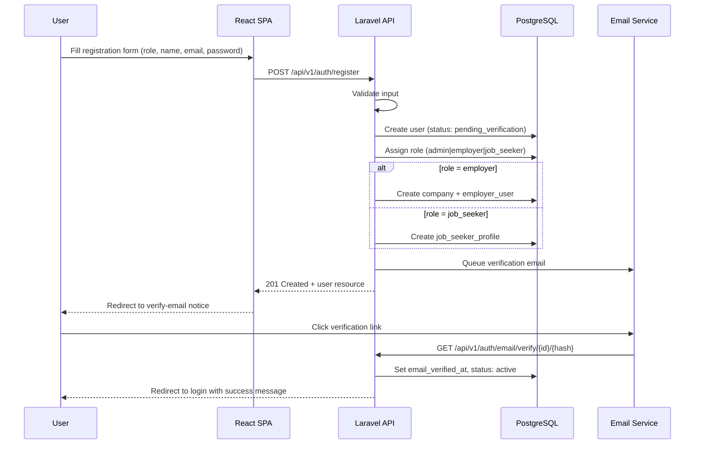

### 12.2 Login Flow (SPA / Sanctum)

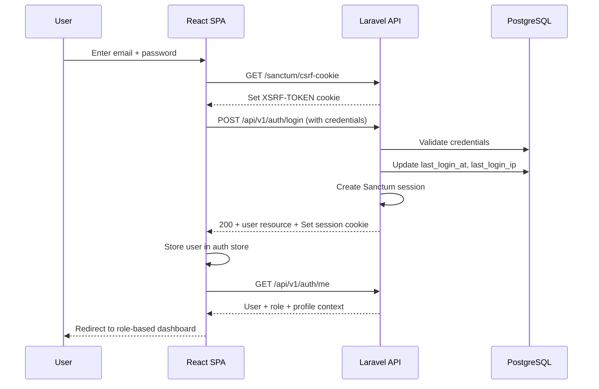

### 12.3 Password Reset Flow

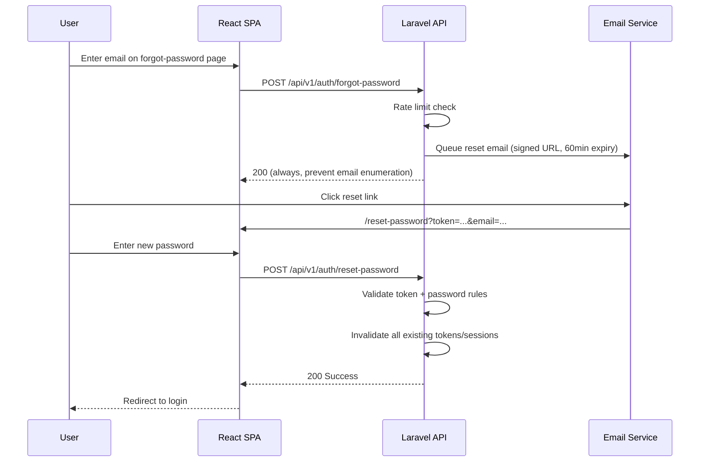

### 12.4 Token Strategy

| Context | Mechanism |
|---------|-----------|
| SPA (primary) | Sanctum stateful cookies (session-based) |
| Mobile / 3rd party (future) | Sanctum personal access tokens |
| CSRF | Laravel Sanctum CSRF cookie for SPA |
| Session lifetime | Configurable (default: 120 minutes) |
| Token abilities | Scoped per token for API clients |

### 12.5 Security Controls

- Password: minimum 8 chars, mixed case, number, symbol (configurable via `system_settings`)
- Bcrypt hashing (cost factor 12)
- Account lockout after 5 failed attempts (15-minute cooldown)
- Email verification required before full access
- All auth events logged to `audit_logs`

---

## 13. Authorization Strategy

### 13.1 Multi-Layer Authorization

```
Request → auth:sanctum → verified (optional) → role middleware → FormRequest authorize() → Policy → Service-level checks
```

### 13.2 Role Middleware

| Middleware | Alias | Description |
|------------|-------|-------------|
| `auth:sanctum` | — | Must be authenticated |
| `verified` | — | Email must be verified |
| `role:admin` | `admin` | Admin only |
| `role:employer` | `employer` | Employer only |
| `role:job_seeker` | `job_seeker` | Job seeker only |

### 13.3 Policy Classes

| Policy | Model | Key Rules |
|--------|-------|-----------|
| `UserPolicy` | User | Admin manages all; users update self |
| `CompanyPolicy` | Company | Employer members of company; admin all |
| `JobPolicy` | Job | Employer owns via company; admin all; public read if published |
| `JobApplicationPolicy` | JobApplication | Seeker owns application; employer owns via job's company |
| `InterviewPolicy` | Interview | Employer schedules; seeker views own; admin all |
| `ResumePolicy` | Resume | Seeker owns; employer views if attached to application |
| `FilePolicy` | File | Uploader owns; employer views applicant files |
| `CompanyVerificationPolicy` | CompanyVerification | Employer submits; admin reviews |

### 13.4 Policy Decision Examples

```
JobPolicy::update(user, job)
  → user has role 'admin' → ALLOW
  → user is employer_user of job.company_id → ALLOW
  → else → DENY

JobApplicationPolicy::view(user, application)
  → user is owner (job_seeker_profile.user_id) → ALLOW
  → user is employer_user of application.job.company_id → ALLOW
  → user has role 'admin' → ALLOW
  → else → DENY
```

### 13.5 Employer Company Context

- Employers may belong to multiple companies (future team feature).
- Current company context stored in session/request header: `X-Company-Id`.
- All employer endpoints scoped to active company context.
- `EmployerCompanyMiddleware` validates user membership before proceeding.

---

## 14. Permissions Matrix

### 14.1 Permission Definitions

| Permission | Description |
|------------|-------------|
| `users.view` | View user list |
| `users.create` | Create users |
| `users.update` | Update users |
| `users.delete` | Delete users |
| `users.suspend` | Suspend/activate users |
| `companies.view` | View companies |
| `companies.update` | Update company profiles |
| `companies.verify` | Review verifications |
| `jobs.view` | View jobs |
| `jobs.create` | Create jobs |
| `jobs.update` | Update jobs |
| `jobs.delete` | Delete jobs |
| `jobs.publish` | Publish/close jobs |
| `applications.view` | View applications |
| `applications.manage` | Update application status |
| `interviews.view` | View interviews |
| `interviews.manage` | Schedule/manage interviews |
| `profiles.view` | View job seeker profiles |
| `profiles.manage` | Manage own profile |
| `resumes.manage` | Manage resumes |
| `analytics.view` | View analytics |
| `analytics.admin` | View platform analytics |
| `settings.manage` | Manage system settings |
| `audit.view` | View audit logs |
| `verifications.review` | Review company verifications |

### 14.2 Role → Permission Mapping

| Permission | Admin | Employer | Job Seeker |
|------------|:-----:|:--------:|:----------:|
| users.view | ✅ | ❌ | ❌ |
| users.create | ✅ | ❌ | ❌ |
| users.update | ✅ | ❌ | ❌ |
| users.delete | ✅ | ❌ | ❌ |
| users.suspend | ✅ | ❌ | ❌ |
| companies.view | ✅ | ✅ (own) | ✅ (public) |
| companies.update | ✅ | ✅ (own) | ❌ |
| companies.verify | ✅ | ❌ | ❌ |
| jobs.view | ✅ | ✅ | ✅ |
| jobs.create | ✅ | ✅ | ❌ |
| jobs.update | ✅ | ✅ (own) | ❌ |
| jobs.delete | ✅ | ✅ (own) | ❌ |
| jobs.publish | ✅ | ✅ (own) | ❌ |
| applications.view | ✅ | ✅ (own jobs) | ✅ (own) |
| applications.manage | ✅ | ✅ (own jobs) | ❌ |
| interviews.view | ✅ | ✅ (own) | ✅ (own) |
| interviews.manage | ✅ | ✅ (own) | ❌ |
| profiles.view | ✅ | ✅ (applicants) | ✅ (own) |
| profiles.manage | ❌ | ❌ | ✅ |
| resumes.manage | ❌ | ❌ | ✅ |
| analytics.view | ✅ | ✅ (own) | ❌ |
| analytics.admin | ✅ | ❌ | ❌ |
| settings.manage | ✅ | ❌ | ❌ |
| audit.view | ✅ | ❌ | ❌ |
| verifications.review | ✅ | ❌ | ❌ |

### 14.3 Route Access Matrix

| Route Prefix | Admin | Employer | Job Seeker | Guest |
|--------------|:-----:|:--------:|:----------:|:-----:|
| `/api/v1/auth/*` | ✅ | ✅ | ✅ | ✅ (register/login) |
| `/api/v1/jobs` (public) | ✅ | ✅ | ✅ | ✅ |
| `/api/v1/admin/*` | ✅ | ❌ | ❌ | ❌ |
| `/api/v1/employer/*` | ❌ | ✅ | ❌ | ❌ |
| `/api/v1/job-seeker/*` | ❌ | ❌ | ✅ | ❌ |
| `/api/v1/notifications` | ✅ | ✅ | ✅ | ❌ |
| `/api/v1/files` | ✅ | ✅ | ✅ | ❌ |

---

## 15. User Journeys

### 15.1 Job Seeker Journey

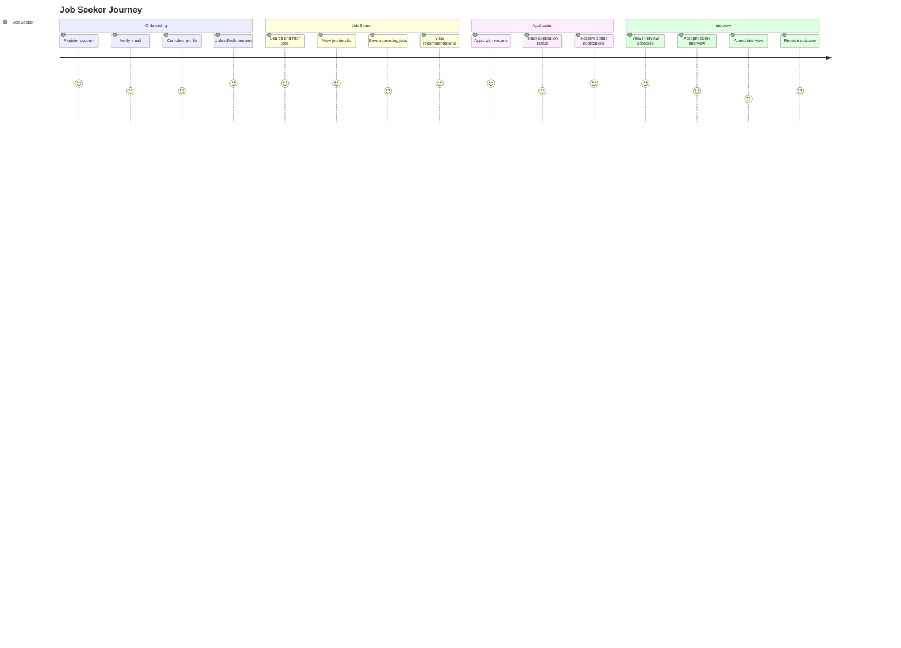

### 15.2 Employer Journey

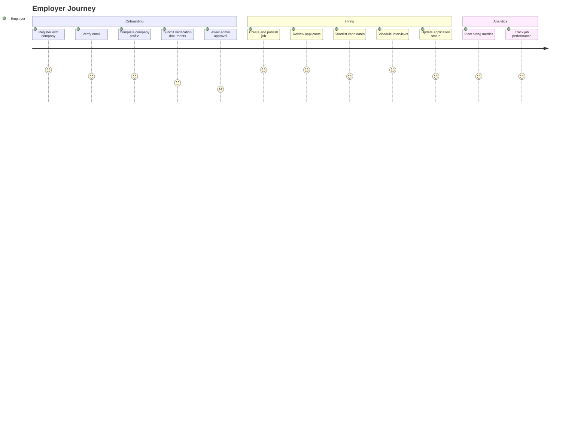

### 15.3 Admin Journey

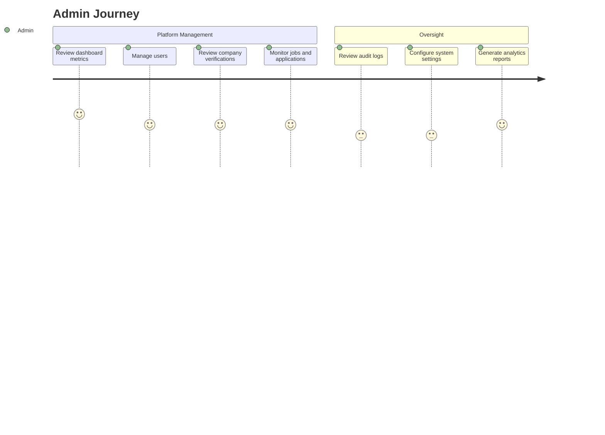

---

## 16. Admin Workflow

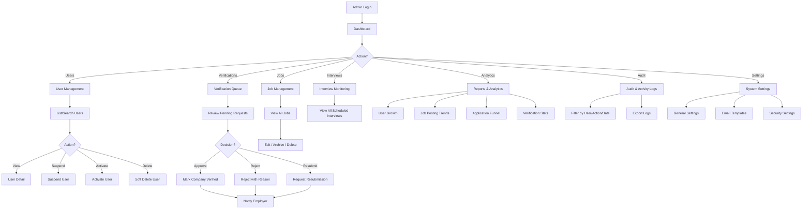

### 16.1 Admin Dashboard Metrics

| Metric | Source |
|--------|--------|
| Total users (by role) | `users` |
| Active jobs | `jobs` WHERE status = published |
| Pending verifications | `company_verifications` WHERE status = pending |
| Applications today | `job_applications` |
| Interviews this week | `interviews` |
| New registrations (7d) | `users.created_at` |
| Top industries | `companies.industry` |
| Application funnel | `job_applications.status` GROUP BY |

---

## 17. Employer Workflow

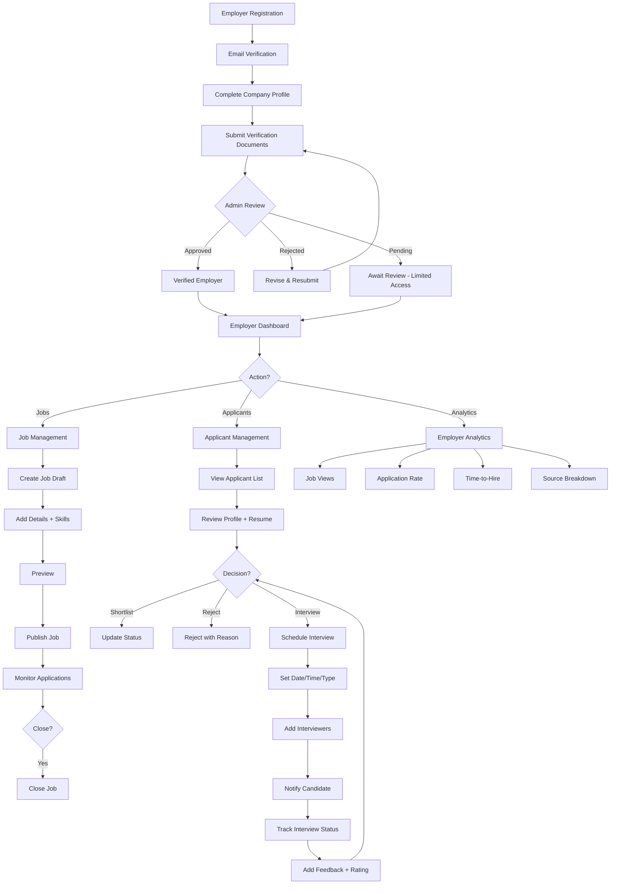

### 17.1 Employer Access States

| State | Can Create Jobs | Can Publish | Can View Applicants |
|-------|:---------------:|:-----------:|:-------------------:|
| Unverified | ✅ (draft only) | ❌ | ❌ |
| Pending Verification | ✅ (draft only) | ❌ | ❌ |
| Verified | ✅ | ✅ | ✅ |
| Rejected | ✅ (draft only) | ❌ | ❌ |
| Suspended | ❌ | ❌ | ❌ |

---

## 18. Job Seeker Workflow

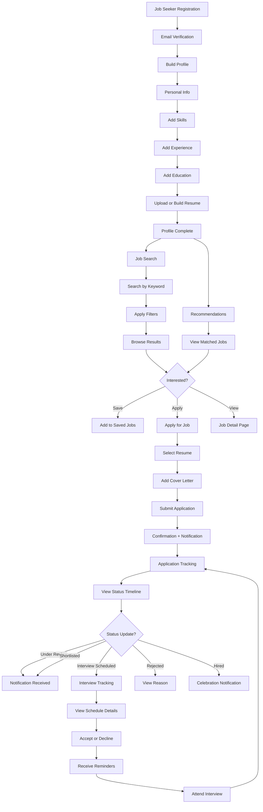

### 18.1 Profile Completion Scoring

| Section | Weight | Criteria |
|---------|--------|----------|
| Basic info | 15% | Name, headline, location filled |
| Summary | 10% | Summary > 50 characters |
| Skills | 15% | ≥ 3 skills added |
| Experience | 25% | ≥ 1 experience entry |
| Education | 15% | ≥ 1 education entry |
| Resume | 20% | Resume uploaded or builder resume created |

---

## 19. Notification Architecture

### 19.1 Overview

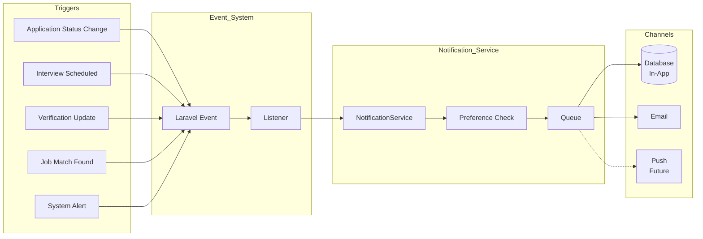

### 19.2 Notification Types

| Type | Trigger | Recipients | Channels |
|------|---------|------------|----------|
| `application_submitted` | Job seeker applies | Employer | DB, Mail |
| `application_status_changed` | Status update | Job Seeker | DB, Mail |
| `interview_scheduled` | Interview created | Job Seeker, Interviewers | DB, Mail |
| `interview_reminder` | 24h before interview | Job Seeker, Interviewers | DB, Mail |
| `interview_cancelled` | Interview cancelled | All participants | DB, Mail |
| `interview_rescheduled` | Date/time changed | All participants | DB, Mail |
| `verification_approved` | Admin approves company | Employer | DB, Mail |
| `verification_rejected` | Admin rejects company | Employer | DB, Mail |
| `job_match` | Recommendation generated | Job Seeker | DB |
| `welcome` | Registration complete | New user | Mail |
| `email_verification` | Registration | New user | Mail |
| `password_reset` | Reset requested | User | Mail |

### 19.3 Notification Data Schema (JSONB)

```json
{
  "title": "Application Status Updated",
  "body": "Your application for Senior Developer at Acme Corp is now Under Review.",
  "action_url": "/job-seeker/applications/{uuid}",
  "icon": "application",
  "entity_type": "job_application",
  "entity_id": 123,
  "entity_uuid": "..."
}
```

### 19.4 Preference Resolution

1. Load user `notification_preferences` for the given `notification_type`.
2. If no preference record exists, use defaults (DB: on, Mail: on, Push: off).
3. Dispatch only to enabled channels.
4. Admin system notifications cannot be opted out of email for security alerts.

### 19.5 Queue Configuration

| Job | Queue | Priority | Retries |
|-----|-------|----------|---------|
| `SendEmailNotification` | `notifications` | Normal | 3 |
| `SendInterviewReminder` | `notifications` | High | 3 |
| `GenerateJobRecommendations` | `recommendations` | Low | 2 |

### 19.6 Scheduled Notifications

| Schedule | Job | Description |
|----------|-----|-------------|
| Every hour | `SendInterviewReminders` | 24h and 1h reminders |
| Daily 06:00 | `GenerateDailyRecommendations` | Batch recommendation scoring |
| Daily 08:00 | `SendWeeklyDigest` | Employer applicant summary (future) |

---

## 20. Resume Builder Architecture

### 20.1 Overview

The Resume Builder allows job seekers to create structured resumes within the platform, independent of uploaded PDF files. Builder resumes can be exported to PDF and used for job applications.

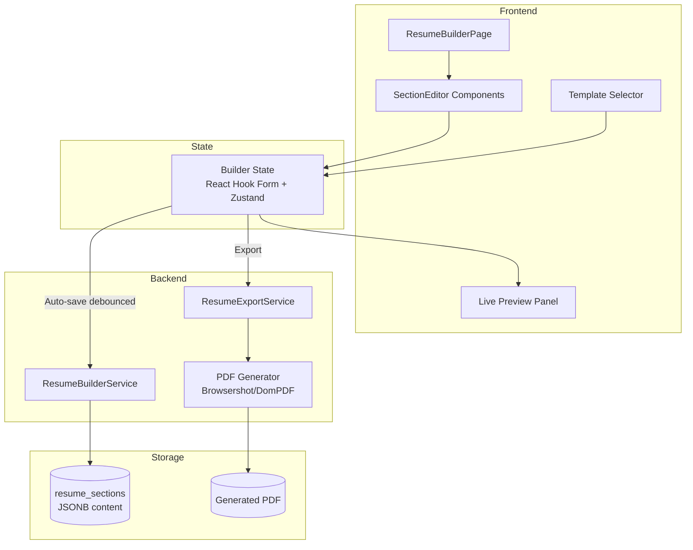

### 20.2 Section Types

| Section Type | Content Schema (JSONB) |
|--------------|------------------------|
| `summary` | `{ text: string }` |
| `experience` | `{ items: [{ company, title, dates, description, is_current }] }` |
| `education` | `{ items: [{ institution, degree, field, dates, grade }] }` |
| `skills` | `{ items: [{ name, proficiency }] }` |
| `certifications` | `{ items: [{ name, issuer, date, url }] }` |
| `custom` | `{ title: string, items: [{ content }] }` |

### 20.3 Templates

| Template Key | Description |
|--------------|-------------|
| `classic` | Traditional single-column layout |
| `modern` | Two-column with sidebar |
| `minimal` | Clean, whitespace-heavy |
| `professional` | Corporate formal style |

Templates are defined as Blade/HTML layouts for PDF export and React components for live preview. Both share the same data schema.

### 20.4 Auto-Save Strategy

- Frontend debounces changes (2-second delay).
- PATCH `/api/v1/job-seeker/resumes/{uuid}/sections` with changed sections.
- Backend upserts `resume_sections` records.
- `metadata` JSONB on `resumes` stores full snapshot for quick restore.
- Conflict resolution: last-write-wins (acceptable for single-user editor).

### 20.5 Profile Sync

- Option to "Import from Profile" populates builder sections from `experiences`, `educations`, `job_seeker_skills`.
- One-way sync: profile → builder (editing builder does not auto-update profile).
- User can explicitly "Sync to Profile" if desired (Phase 2).

### 20.6 PDF Export Pipeline

```
ResumeBuilderService::export(resume)
  → Load resume + sections
  → Render Blade template with data
  → Browsershot (headless Chrome) → PDF
  → FileUploadService::store(pdf, type: resume)
  → Update resume.file_id
  → Return signed download URL
```

### 20.7 Uploaded vs Builder Resumes

| Source | Storage | Application Use |
|--------|---------|-----------------|
| `upload` | Original file in S3 | Direct attachment |
| `builder` | Sections in DB + generated PDF in S3 | Generated PDF attached |

Job seeker selects which resume to use per application.

---

## 21. Job Recommendation Architecture

### 21.1 Overview

Phase 1 uses a **rule-based scoring engine**. Phase 3+ adds AI-enhanced matching (architecture hooks only).

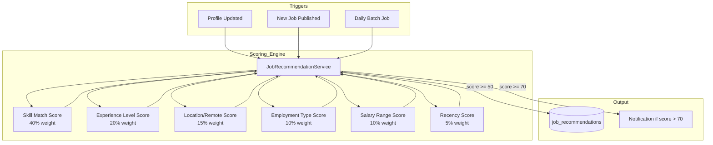

### 21.2 Scoring Algorithm (Phase 1)

```
total_score = (
    skill_match      * 0.40 +
    experience_match * 0.20 +
    location_match   * 0.15 +
    employment_match * 0.10 +
    salary_match     * 0.10 +
    recency          * 0.05
) * 100
```

#### Skill Match (40%)

```
matched_skills = intersection(job_skills, seeker_skills)
skill_match = len(matched_skills) / len(job_skills_required) 
              * (avg seeker proficiency / 5)
```

#### Experience Level (20%)

| Seeker Experience | Job Level | Score |
|-------------------|-----------|-------|
| 0–2 years | entry | 1.0 |
| 2–5 years | mid | 1.0 |
| 5–10 years | senior | 1.0 |
| 10+ years | lead | 1.0 |
| Adjacent levels | — | 0.5 |
| 2+ levels apart | — | 0.1 |

#### Location Match (15%)

| Condition | Score |
|-----------|-------|
| Job remote | 1.0 |
| Same city | 1.0 |
| Same state | 0.7 |
| Same country | 0.4 |
| Different country | 0.1 |

### 21.3 Recommendation Lifecycle

| Event | Action |
|-------|--------|
| Score calculated ≥ 50 | Upsert `job_recommendations` |
| Score calculated < 50 | Delete existing recommendation if any |
| Score ≥ 70 and not dismissed | Send `job_match` notification |
| User dismisses | Set `is_dismissed = true` |
| Job closed | Delete related recommendations |
| 30 days elapsed | Expire recommendation (`expires_at`) |

### 21.4 Future AI Enhancement (Architecture Only)

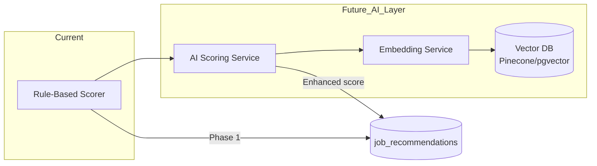

- `ai_analysis_results` table stores AI outputs.
- Resume text and job descriptions embedded for semantic similarity.
- AI score blended with rule-based score: `final = rule * 0.4 + ai * 0.6`.
- Feature flag in `system_settings`: `ai_recommendations_enabled`.

---

## 22. Dark Mode Architecture

### 22.1 Strategy

Use **CSS custom properties (design tokens)** with Tailwind CSS `darkMode: 'class'` strategy. Theme state managed via React context with localStorage persistence.

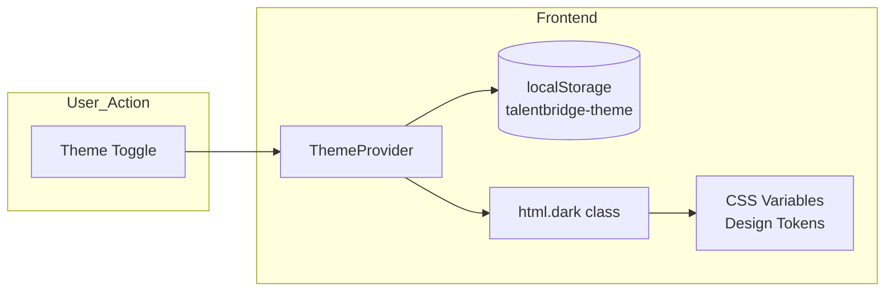

### 22.2 Theme Provider

```
ThemeProvider
  ├── state: 'light' | 'dark' | 'system'
  ├── resolvedTheme: 'light' | 'dark' (computed from system if 'system')
  ├── setTheme(theme)
  └── useEffect: apply class to <html>, persist to localStorage
```

### 22.3 Design Tokens

```css
/* light.css */
:root {
  --background: 0 0% 100%;
  --foreground: 222.2 84% 4.9%;
  --primary: 221.2 83.2% 53.3%;
  --primary-foreground: 210 40% 98%;
  --secondary: 210 40% 96.1%;
  --muted: 210 40% 96.1%;
  --accent: 210 40% 96.1%;
  --destructive: 0 84.2% 60.2%;
  --border: 214.3 31.8% 91.4%;
  --ring: 221.2 83.2% 53.3%;
  --card: 0 0% 100%;
  --sidebar: 0 0% 98%;
}

/* dark.css */
.dark {
  --background: 222.2 84% 4.9%;
  --foreground: 210 40% 98%;
  --primary: 217.2 91.2% 59.8%;
  --primary-foreground: 222.2 47.4% 11.2%;
  --secondary: 217.2 32.6% 17.5%;
  --muted: 217.2 32.6% 17.5%;
  --accent: 217.2 32.6% 17.5%;
  --destructive: 0 62.8% 30.6%;
  --border: 217.2 32.6% 17.5%;
  --ring: 224.3 76.3% 48%;
  --card: 222.2 84% 4.9%;
  --sidebar: 222.2 84% 6.9%;
}
```

### 22.4 ShadCN Integration

- All ShadCN components use CSS variable-based theming by default.
- `tailwind.config.js` maps Tailwind colors to CSS variables.
- No component-level theme overrides needed.

### 22.5 Flash Prevention

- Inline `<script>` in `app.blade.php` reads `localStorage` and applies `dark` class before React hydration.
- Prevents white flash on page load for dark mode users.

### 22.6 System Preference

- Default theme: `system` (respects `prefers-color-scheme` media query).
- `window.matchMedia('(prefers-color-scheme: dark)')` listener for live OS changes.

---

## 23. Future Subscription Architecture

> **Status:** Design only. Not implemented in Phase 1–3.

### 23.1 Overview

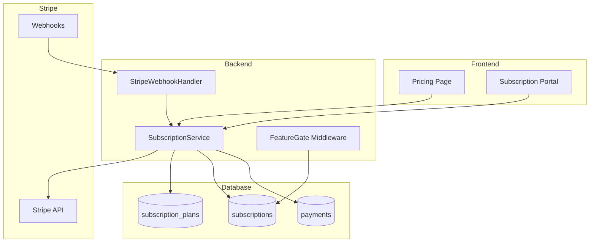

### 23.2 Planned Subscription Tiers

| Feature | Free | Starter | Professional | Enterprise |
|---------|:----:|:-------:|:------------:|:----------:|
| Job postings / month | 1 | 5 | 25 | Unlimited |
| Applicant views | 10 | 100 | Unlimited | Unlimited |
| Team members | 1 | 3 | 10 | Unlimited |
| Analytics | Basic | Basic | Advanced | Custom |
| Featured jobs | ❌ | ❌ | ✅ | ✅ |
| AI resume analysis | ❌ | ❌ | ✅ | ✅ |
| Priority support | ❌ | ❌ | ✅ | ✅ |
| Custom branding | ❌ | ❌ | ❌ | ✅ |

### 23.3 Feature Gating

```php
// FeatureGate middleware (future)
FeatureGate::check('job_posting', $company)
  → Load active subscription
  → Check plan features JSONB
  → Check usage counters
  → ALLOW or DENY with upgrade prompt
```

### 23.4 Usage Tracking

| Metric | Storage | Reset |
|--------|---------|-------|
| Jobs posted this period | `subscriptions.usage` JSONB | Billing cycle |
| Applicants viewed | `subscriptions.usage` JSONB | Billing cycle |

### 23.5 Stripe Integration Points

| Event | Handler |
|-------|---------|
| `checkout.session.completed` | Create subscription |
| `invoice.paid` | Extend subscription period |
| `invoice.payment_failed` | Set status `past_due`, notify |
| `customer.subscription.updated` | Sync plan changes |
| `customer.subscription.deleted` | Set status `cancelled` |

### 23.6 Extension Points (Built in Phase 1)

- `companies.settings` JSONB includes `subscription_tier: 'free'` placeholder.
- `FeatureGate` middleware stub registered but passes all requests.
- `subscription_plans` migration ready but not seeded.

---

## 24. Development Roadmap

### 24.1 Timeline Overview

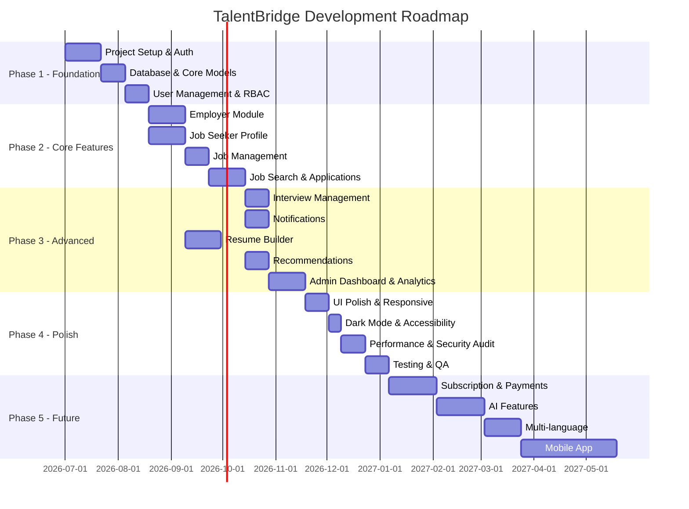

### 24.2 Milestone Deliverables

| Milestone | Target | Deliverable |
|-----------|--------|-------------|
| M1: Foundation | Week 7 | Auth, RBAC, DB, project scaffold |
| M2: MVP Employer | Week 13 | Company profile, job CRUD, verification |
| M3: MVP Job Seeker | Week 13 | Profile, resume upload, job search, apply |
| M4: Full ATS | Week 20 | Interviews, notifications, admin panel |
| M5: Production Ready | Week 25 | Polish, testing, security audit |
| M6: Monetization | Week 29 | Stripe subscriptions |
| M7: AI & Mobile | Week 40 | AI features, mobile app |

---

## 25. Phase-wise Implementation Plan

### Phase 1: Foundation (Weeks 1–7)

#### Backend
- [ ] Laravel 12 project scaffold with PostgreSQL
- [ ] Sanctum SPA authentication setup
- [ ] Spatie Permission integration
- [ ] Database migrations (all core tables)
- [ ] Seeders: roles, permissions, admin user, job categories, skills
- [ ] Auth module: register, login, logout, forgot/reset password, email verification
- [ ] User module: CRUD, status management
- [ ] Base API response envelope
- [ ] Rate limiting configuration
- [ ] Audit log service + observers
- [ ] File upload service (S3 + local)
- [ ] CORS configuration

#### Frontend
- [ ] Vite + React 19 + TypeScript setup
- [ ] ShadCN UI installation and theme configuration
- [ ] Tailwind CSS with design tokens
- [ ] API client (Axios + interceptors)
- [ ] TanStack Query setup
- [ ] Auth provider + auth store
- [ ] Route structure with protected/role routes
- [ ] Auth pages: login, register, forgot/reset password, verify email
- [ ] Layout components: AuthLayout, AppLayout
- [ ] Theme provider (light/dark/system)

#### DevOps
- [ ] Docker Compose (Sail) development environment
- [ ] `.env.example` with all required variables
- [ ] GitHub Actions CI: lint, test, build

---

### Phase 2: Core Features (Weeks 8–16)

#### Employer Module
- [ ] Company profile CRUD
- [ ] Company verification submission
- [ ] Employer dashboard (basic stats)
- [ ] Job CRUD (draft, publish, close)
- [ ] Job skills management
- [ ] Employer frontend pages

#### Job Seeker Module
- [ ] Profile CRUD with completion scoring
- [ ] Experience, education, skills CRUD
- [ ] Resume upload
- [ ] Job search with filters (public + authenticated)
- [ ] Job application flow
- [ ] Saved jobs
- [ ] Application tracking with status timeline
- [ ] Job seeker frontend pages

#### Admin Module
- [ ] Admin dashboard
- [ ] User management (list, view, suspend, delete)
- [ ] Verification review workflow
- [ ] Job management (view all, archive)
- [ ] Admin frontend pages

---

### Phase 3: Advanced Features (Weeks 17–22)

- [ ] Interview scheduling and management
- [ ] Interview participant management
- [ ] Interview reminders (scheduled job)
- [ ] Application status history tracking
- [ ] Email notification system (all types)
- [ ] In-app notification system
- [ ] Notification preferences
- [ ] Resume builder (sections, templates, preview)
- [ ] Resume PDF export
- [ ] Job recommendation engine (rule-based)
- [ ] Admin analytics and reports
- [ ] Activity log feed
- [ ] Audit log viewer
- [ ] System settings management
- [ ] Employer analytics

---

### Phase 4: Polish & Production (Weeks 23–27)

- [ ] Responsive design audit (mobile, tablet)
- [ ] Accessibility audit (WCAG 2.1 AA)
- [ ] Dark mode polish
- [ ] Performance optimization (query optimization, eager loading, caching)
- [ ] Security audit (OWASP top 10)
- [ ] Rate limiting fine-tuning
- [ ] Error handling and user feedback polish
- [ ] Comprehensive test suite (Feature + Unit)
- [ ] API documentation (OpenAPI/Swagger)
- [ ] Load testing
- [ ] Production deployment setup
- [ ] Monitoring and alerting (Sentry, health checks)

---

### Phase 5: Future Features (Weeks 28+)

- [ ] Subscription plans and Stripe integration
- [ ] Feature gating middleware
- [ ] AI job recommendations (embedding-based)
- [ ] AI resume analysis
- [ ] Multi-language support (i18n)
- [ ] Mobile application (React Native or Flutter)
- [ ] Real-time notifications (WebSockets/Reverb)
- [ ] Elasticsearch integration for advanced search
- [ ] Calendar integration (Google/Outlook)
- [ ] Webhook API for third-party integrations

---

## 26. Risks & Scalability Considerations

### 26.1 Technical Risks

| Risk | Impact | Probability | Mitigation |
|------|--------|-------------|------------|
| PostgreSQL full-text search limits at scale | High | Medium | Design Elasticsearch migration path; abstract search behind `JobSearchService` interface |
| Large file uploads (resumes) | Medium | High | Max 5MB limit; async processing; S3 direct upload with presigned URLs |
| N+1 query problems | High | High | Strict eager loading policy; Laravel Debugbar in dev; CI query count checks |
| Session management at scale | Medium | Low | Redis session driver; sticky sessions behind load balancer |
| Email deliverability | Medium | Medium | Use transactional email service (SES/Mailgun); SPF/DKIM/DMARC setup |
| PDF generation performance | Medium | Medium | Queue-based export; cache generated PDFs; Browsershot pool |

### 26.2 Security Risks

| Risk | Mitigation |
|------|------------|
| SQL Injection | Eloquent ORM exclusively; no raw queries without bindings |
| XSS | React auto-escaping; CSP headers; sanitize rich text input |
| CSRF | Sanctum CSRF for SPA; token validation |
| Unauthorized access | Policy-based authorization at every endpoint; automated policy tests |
| File upload attacks | MIME validation; extension whitelist; size limits; store outside webroot |
| Brute force | Rate limiting on auth endpoints; account lockout |
| Data exposure | API Resources control output fields; no sensitive data in logs |
| Mass assignment | `$fillable` / `$guarded` on all models; Form Request validation |

### 26.3 Scalability Strategy

#### Horizontal Scaling

| Component | Strategy |
|-----------|----------|
| Laravel API | Stateless; scale PHP-FPM workers behind load balancer |
| Queue Workers | Scale independently based on queue depth |
| PostgreSQL | Read replicas for reporting/analytics queries |
| Redis | Redis Cluster for cache + sessions at scale |
| File Storage | S3 (inherently scalable) |

#### Database Scaling

| Threshold | Action |
|-----------|--------|
| 1M+ rows in `jobs` | Partial indexes on active jobs; archive closed jobs |
| 10M+ rows in `audit_logs` | Monthly table partitioning |
| 5M+ rows in `notifications` | Archive read notifications older than 90 days |
| Slow search queries | Migrate to Elasticsearch |

#### Caching Strategy

| Data | Cache | TTL |
|------|-------|-----|
| Job categories | Redis | 24 hours |
| Skills list | Redis | 24 hours |
| System settings | Redis | 1 hour |
| Dashboard stats (employer) | Redis | 5 minutes |
| Dashboard stats (admin) | Redis | 5 minutes |
| Public job listings | Redis | 2 minutes |
| User permissions | Redis | Session lifetime |

### 26.4 Performance Targets

| Metric | Target |
|--------|--------|
| API response (p95) | < 200ms |
| Page load (LCP) | < 2.5s |
| Job search results | < 500ms |
| File upload (5MB) | < 5s |
| PDF export | < 10s (async) |
| Concurrent users | 1,000+ (Phase 1 target) |
| Database connections | PgBouncer connection pooling |

### 26.5 Data Privacy & Compliance

| Concern | Approach |
|---------|----------|
| GDPR right to erasure | Soft delete + anonymization job for hard delete requests |
| Data export | Admin/self-service data export endpoint (future) |
| PII in logs | Never log passwords, tokens, or full resume content |
| Data retention | Configurable retention policies for audit/activity logs |
| Consent | Terms acceptance at registration; cookie consent banner |

### 26.6 Disaster Recovery

| Component | Strategy | RTO | RPO |
|-----------|----------|-----|-----|
| PostgreSQL | Daily backups + WAL archiving; point-in-time recovery | 1 hour | 5 minutes |
| S3 Files | Cross-region replication | 0 | 0 |
| Redis | AOF persistence; replica | 15 minutes | 1 minute |
| Application | Multi-AZ deployment; blue-green deploys | 5 minutes | 0 |

### 26.7 Monitoring & Observability

| Area | Tool |
|------|------|
| Application errors | Sentry |
| Performance (APM) | Laravel Telescope (dev); Datadog/New Relic (prod) |
| Infrastructure | CloudWatch / Grafana |
| Uptime | Health check endpoint `/api/health` |
| Queue monitoring | Laravel Horizon |
| Log aggregation | Structured JSON → CloudWatch Logs / ELK |

---

## Appendix A: Environment Variables

| Variable | Description | Example |
|----------|-------------|---------|
| `APP_NAME` | Application name | TalentBridge |
| `APP_URL` | Application URL | https://talentbridge.com |
| `DB_CONNECTION` | Database driver | pgsql |
| `DB_HOST` | PostgreSQL host | 127.0.0.1 |
| `REDIS_HOST` | Redis host | 127.0.0.1 |
| `FILESYSTEM_DISK` | Default storage disk | s3 |
| `AWS_BUCKET` | S3 bucket name | talentbridge-files |
| `SANCTUM_STATEFUL_DOMAINS` | SPA domains | talentbridge.com |
| `FRONTEND_URL` | React SPA URL | https://app.talentbridge.com |
| `MAIL_MAILER` | Mail driver | ses |
| `QUEUE_CONNECTION` | Queue driver | redis |
| `SESSION_DRIVER` | Session driver | redis |
| `STRIPE_KEY` | Stripe public key *(future)* | pk_live_... |
| `STRIPE_SECRET` | Stripe secret key *(future)* | sk_live_... |

---

## Appendix B: Implementation Prompt Guidelines

When implementing any feature, reference this document and follow these rules:

1. **Check the relevant section** before writing code (DB schema §6, API §11, permissions §14).
2. **Follow the module structure** defined in §9 (backend) and §10 (frontend).
3. **Use the service layer pattern**: Controller → Service → Repository → Model.
4. **Apply policies** for every resource endpoint (§13).
5. **Use the API response envelope** (§2.5) for all responses.
6. **Follow naming conventions** from §4.1 for database columns and tables.
7. **Respect phase boundaries** (§25) — do not implement future-phase features early.
8. **Write tests** for services and API endpoints.
9. **Log audit events** for all create/update/delete operations.
10. **Do not deviate** from this architecture without updating this document first.

---

*End of TalentBridge Architecture Document v1.0.0*
